# 《SpringSecurity 速速上手👊🏼》

**本笔记学习于：[哔哩哔哩 三更草堂👉](https://www.bilibili.com/video/BV1mm4y1X7Hc/?p=2&spm_id_from=pageDriver&vd_source=19e007a1660dfd5c8f1744e56d027bf4)**、感谢大佬、三更`せんせい`，录制分享📼🧎‍♂️🧎‍♂️🧎‍♂️

**可能设计的知识：** [JWT令牌](https://blog.csdn.net/qq_45542380/article/details/113836330?spm=1001.2014.3001.5502)、[会话控制](https://juejin.cn/post/7363482010659455030)、blog中涉及其他内容，可以直接跳对应的项中查看；

**个人觉得登录、真的是初学者最头疼的一个Boss👾：** 虽然看着简简单单、但背后要走的流程可以说千辛万苦；

- **仅仅，开发模式就有：** 单体项目、前后端分离、分布式、微服务、单点登录…

- **其，涉及的技术：** `Http协议`、`cookie`、``session``、`token` 、`JWT`、`OAuth2`、`sso`

看的我，头都大了，都是为了安全、安全、**上面的技术概念，现在我都一知半懂的，原理类似，又各不相同** 

**且每个项目技术栈组合又能组个千百套组合拳👊🏼** 衍生的—知名登录安全框架有：`Shiro`、`SpringSecurity`

**既然，躲避不掉只能迎男而上，借助目前最流行开发默认：** `前后端分离模式+SpringSecurity` 深入了解一下：登录认证吧；

## SpringSecurity 介绍：

**Spring Security 是一个全面的、高度可定制的安全框架：**　专为基于`Java`的应用程序设计，以提供身份验证和授权服务；

集成于`Spring`生态系统中，利用`Spring`的`IoC`容器、`AOP`特性，**确保了安全策略的灵活配置和管理，核心功能👇**

- **身份验证`Authentication`：** `Spring Security`通过`AuthenticationManager`接口管理认证过程；

  允许使用多种认证机制，确认用户身份的过程，包括：`验证用户名`、`密码`、`OAuth2登录`、`JWT验证` 等…

- **认证授权`Authoriztion`：** 用户登录成功，控制已认证用户访问资源的权限；

  通过角色 `Role-based Access Control, RBAC` 、访问控制列表`ACL`来实现，**确保用户只能访问他们被允许的资源；**

**SpringSecurity 和 Shiro 选择：**

**因为目前，Java几乎都是SpringBoot：** 提供了自动化配置方案，使用更少的配置来使用 `Spring Security`

**Apache Shiro：** 简单易用、Shiro API设计直观，易于理解，对于中小规模项目来说，快速上手并实现；

- **轻量级：** 不依赖于特定的框架或容器，可以独立运行，这使得它在非Spring环境中同样适用，

**所以：** 建议优先，选择Security 学习；

## SpringSecurity 环境搭建：

**首先：我们要先搭建一个SpringBoot项目：** [简简单单~](https://blog.csdn.net/qq_45542380/article/details/112851673) 

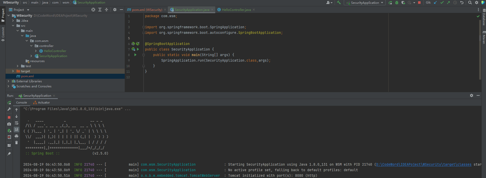

```xml
<!-- SpringBoot依赖配置: -->
<!-- 父依赖: -->
    <parent>
        <groupId>org.springframework.boot</groupId>
        <artifactId>spring-boot-starter-parent</artifactId>
        <version>2.5.0</version>
    </parent>
<!-- 项目依赖: -->
<dependencies>
    <dependency>
        <groupId>org.springframework.boot</groupId>
        <artifactId>spring-boot-starter-web</artifactId>
    </dependency>
    <dependency>
        <groupId>org.projectlombok</groupId>
        <artifactId>lombok</artifactId>
        <optional>true</optional>
    </dependency>
</dependencies>
```

🆗，如此简单就搭建好了一个：SpringBoot项目，并成功访问：`127.0.0.1:8080/hello` 请求

## 引入Security Maven依赖配置：

**pom.xml：** 在`SpringBoot`项目中使用`SpringSecurity`，我们只需要引入依赖即可实现入门案例；

```xml
<!-- SpringSecurity依赖 -->
<dependency>
    <groupId>org.springframework.boot</groupId>
    <artifactId>spring-boot-starter-security</artifactId>
</dependency>
```

引入依赖之后，在去尝试访问：`/hello`接口——>自动跳转到 `SpringSecurity` **默认登陆页面：`/login`** 

**并在，控制台输出：** 默认用户名：`user`，密码：`随机`，只有成功登录之后才可以访问`/hello` 

**`/logout`：** 可注销，登录状态，下次请求继续需要重新登录`/login` 

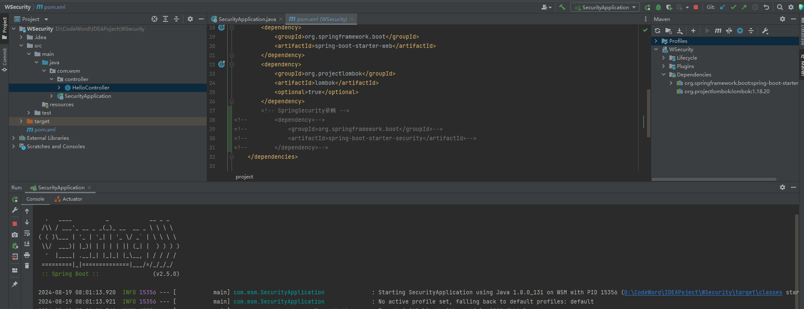

# 原理分析- 简略版)：

🆗，上述已经完成了`Security`  的简单整合，虽然已经有了登录、注销、验证，显然实际项目中并不是这个样子；

`Security`依赖默认：是以一种单体项目的登录认证环境，所以内置了登录页、登录\注销接口；

**而，对于前后端分离环境的登录大致如下👇：** ~其实相差不大~

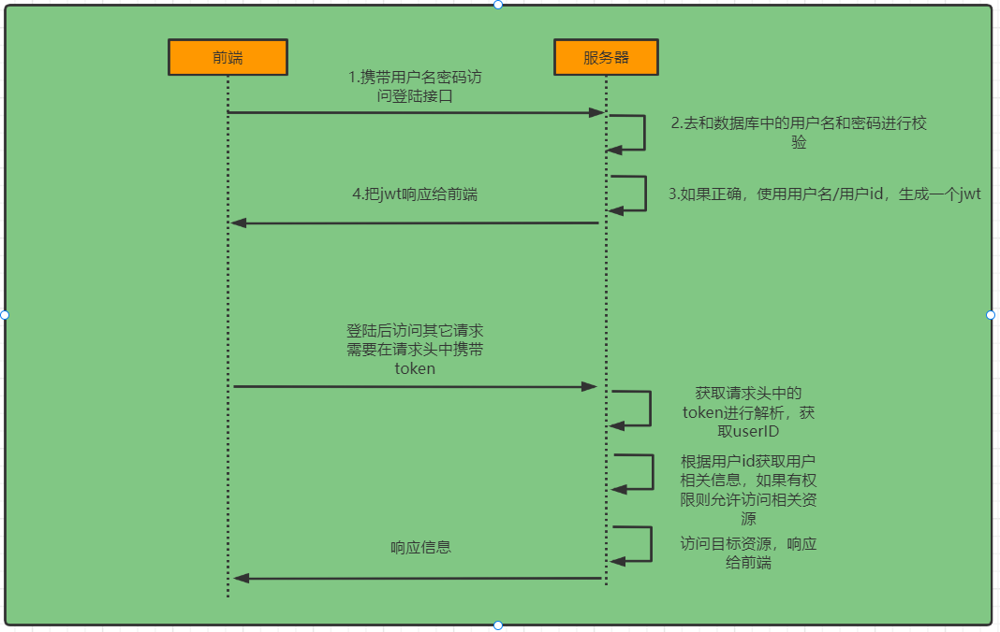

## 登录校验流程\史：

- **前端：** 登录页，用户输入登录信息：`用户名\密码\验证码...`，请求，后端服务器登录接口；
- **后端：** 对用户信息进行校验，校验通过生成一个`JWT`，并响应给前端；
- **前端：接收并保存`JWT`**，并在之后的每一次请求都携带`JWT`
- **后端：通过解析`JWT`：** 获取用户信息，判断是否有权限资源，最后返回相应资源给前端；

**上述，是一个常见的前后端分离项目：登录、认证流程：** 

**部分情况还会出现：** 后端生成的是一个`普通Token`，通过`Token+Redis`获取用户信息、

且为了避免，每个接口都去需要去进行登录认证、通常定义为一个拦截器，对每一个接口进行校验过滤；

而，还有特殊接口不需要登录校验，如登录之前的操作：`验证码`、`登录` 本身就没有登录，所以需要进行排除过滤拦截；

**登录的前后逻辑，无非就是怎么存怎么取方便安全，单体项目：不同之处，** 因为早期单体程序，用户信息都存储在`Session`中

- `Session+Cookie`，`Session`则受服务器的性能影响，又会扩展`Redis+SessioID` 获取，到此，已经可以解决大部分问题；

**之后，前端领域飞速发展，开始了前后端分离：** 一个前端可能对应多个后端服务器，导致`Session` 开始捉襟见肘、没落；

`Token` 开始出现，最开始是 `普通Token`，通过一种加解密机制，通常是一个加密的字符串，不包含用户信息，

服务器端有一个对应记录，关联用户身份，完成简单的登录校验，**在之后：开始出现`JWT`** 属于Token的高级加密；

它包含三部分：`Header 头部`、`Payload 负载`、`Signature 签名` **包含了用户信息，更安全，并加入了过期时间机制；**

## Security 原理分析：

**`SpringSecurity` 原理：其实就是一个`过滤器链`，内部包含了提供各种功能的过滤器：**


- 客户端发起一个请求，在请求到达`Controller`前=> **需要通过Security一系列的过滤处理：** `此处仅介绍核心过滤器`

**UsernamePasswordAuthenticationFilter：** `Spring Security`用于处理基于表单的用户名和密码登录的特定过滤器；

- 负责处理：登陆页面，填写了 用户名、密码后的登陆请求，**Security 默认在此做了基于内存的默认登录操作；**
- **实际开发中：** 此处我们需要修改，重写，**修改为基于：数据库请求的登录信息校验；**

**ExceptionTranslationFilter： 异常处理过滤器，** 凡是在过滤器环节出现的错误都或转到该过滤器进行统一处理；

**FilterSecurityInterceptor： 负责权限校验的过滤器，** 它拦截HTTP请求，根据配置的安全规则决定是否允许访问资源；

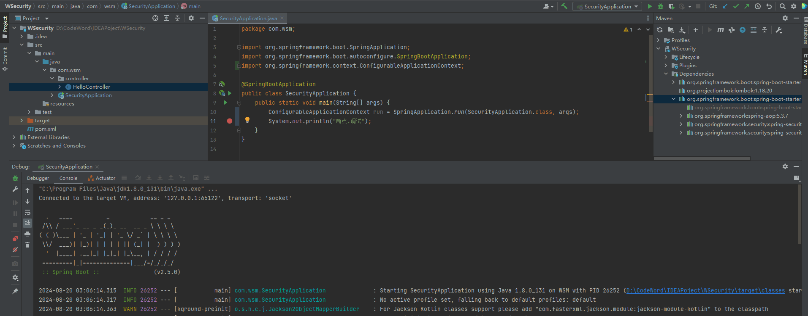

**如果有兴趣可以通过：**  断点调试+`getBean(DefaultSecurityFilterChain.class);` 查看其过滤器；

## Security 认证流程详解：

**🙏🏼感谢，三更老师，画的图很全面的介绍了：==默认案例的认证开发流程：==** ⚠️⚠️


- 用户在`/login`前端界面输入用户名和密码，点击登录，

  首先经过，`UsernamePasswordAuthenticationFitter` 过滤器，内将：用户名、密码封装为：**==Authentication对象==**

- **继续，调用—Provider—调用DaoAuthenticationProvider—直至—调用—默认：loadUserByUsername方法：**

  **默认：从内存中获取用户信息、权限信息，封装权限信息—至> ==UserDetails对象，并返回==** 

  **判断：UserDetails 和 Authentication 用户信息密码是否匹配，**

  **匹配：将权限信息赋值 Authentication对象中；**

  **最终：返回Authentication对象；**

- **最后：将Authentication对象，存入 `SecurityContextHolder.getContext().set..`** 当前线程上下文信息，

## 自定义设计+登录认证流程🪵：

## 身份验证：

**上述，了解了Security 默认基本流程：** 而我们要将其改造为自己的版本，

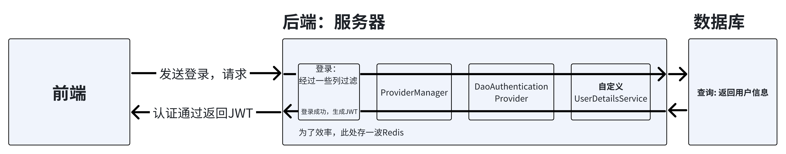

- **修改：** 默认，内存获取用户信息，改由数据库获取，**重写：** `UserDetailsService接口` 从数据库获取用户信息；
- **并：** 调用`ProviderManager`的方法进行认证，在验证登录成功之后生成`JWT`，将用户信息存 `Redis` 方便后续快速获取；

## 认证授权：

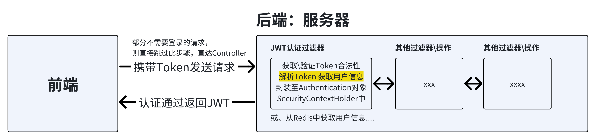

- **定义`JWT`认证过滤器：** 获取\解析`Token`、 从`Redis`中获取用户信息，存入`SecurityContextHolder`

# 代码实践-认证：

## 准备工作：

在环境搭建这一块主要是以代码块为主，因为这一块没有涉及到很多的新知识，**快速操作~** 

**添加：Maven依赖：** 

```xml
<!--redis依赖-->
<dependency>
    <groupId>org.springframework.boot</groupId>
    <artifactId>spring-boot-starter-data-redis</artifactId>
</dependency>
<!--fastjson依赖-->
<dependency>
    <groupId>com.alibaba</groupId>
    <artifactId>fastjson</artifactId>
    <version>1.2.33</version>
</dependency>
<!--jwt依赖-->
<dependency>
    <groupId>io.jsonwebtoken</groupId>
    <artifactId>jjwt</artifactId>
    <version>0.9.0</version>
</dependency>
```

**定义：添加程序所需的工具、配置、数据库交互文件；**

```sh
├── WSecurity
├── pom.xml											#Maven依赖配置:
├── src
    ├── main
    │   ├── java
    │   │   ├── com.wsm
    │   │   │   ├── controller
    │   │   │   │   ├── HelloController
    │   │   │   ├── config							#定义配置文件类型
    │   │   │   │   ├── RedisConfig						#Redis配置类
    │   │   │   ├── domain							#定义数据模型: DAO\POJO...
    │   │   │   │   ├── ResponseResult					#统一响应类型
    │   │   │   │   ├── User							#用户实体类
    │   │   │   ├── utils							#utils 内定义程序工具类,JWT、Redis...
    │   │   │   │   ├── FastJsonRedisSerializer			#Redis存取JSON转对象工具
    │   │   │   │   ├── RedisCache						#Redis存取工具
    │   │   │   │   ├── JwtUtil							#JWT生成工具
    │   │   │   │   ├── WebUtils						#设置响应工具
    │   │   │   ├── SecurityApplication				#程序入口文件;
    │   ├── resources
```


## 自定义获取用户信息：

**上述，原理分析：** 我们知道`SpringSecurity` 默认`UserDetailsService` 从内存中获取用户信息进行校验，

**而实际开发过程中：** 我们需要自定义一个`UserDetailsService` 实现类，**从数据库中查询用户名和密码；** 

### 引入Mybatis-Plus：

**🆗，那我们先定义一个数据库：`SQL用户表: sys_user`** 建表语句如下： 

```sql
-- 创建 sys_user 表
CREATE TABLE `sys_user` (
  `id` BIGINT(20) NOT NULL AUTO_INCREMENT COMMENT '主键',
  `user_name` VARCHAR(64) NOT NULL DEFAULT 'NULL' COMMENT '用户名',
  `nick_name` VARCHAR(64) NOT NULL DEFAULT 'NULL' COMMENT '昵称',
  `password` VARCHAR(64) NOT NULL DEFAULT 'NULL' COMMENT '密码',
  `status` CHAR(1) DEFAULT '0' COMMENT '账号状态（0正常 1停用）',
  `email` VARCHAR(64) DEFAULT NULL COMMENT '邮箱',
  `phonenumber` VARCHAR(32) DEFAULT NULL COMMENT '手机号',
  `sex` CHAR(1) DEFAULT NULL COMMENT '用户性别（0男，1女，2未知）',
  `avatar` VARCHAR(128) DEFAULT NULL COMMENT '头像',
  `user_type` CHAR(1) NOT NULL DEFAULT '1' COMMENT '用户类型（0管理员，1普通用户）',
  `create_by` BIGINT(20) DEFAULT NULL COMMENT '创建人的用户id',
  `create_time` DATETIME DEFAULT NULL COMMENT '创建时间',
  `update_by` BIGINT(20) DEFAULT NULL COMMENT '更新人',
  `update_time` DATETIME DEFAULT NULL COMMENT '更新时间',
  `del_flag` INT(11) DEFAULT '0' COMMENT '删除标志（0代表未删除，1代表已删除）',
  PRIMARY KEY (`id`)
) ENGINE=INNODB AUTO_INCREMENT=2 DEFAULT CHARSET=utf8mb4 COMMENT='用户表'
```

**项目中：引入MybatisPuls和mysql驱动的依赖、配置数据库信息、定义Mapper、User、主启动器设置扫描路径** 

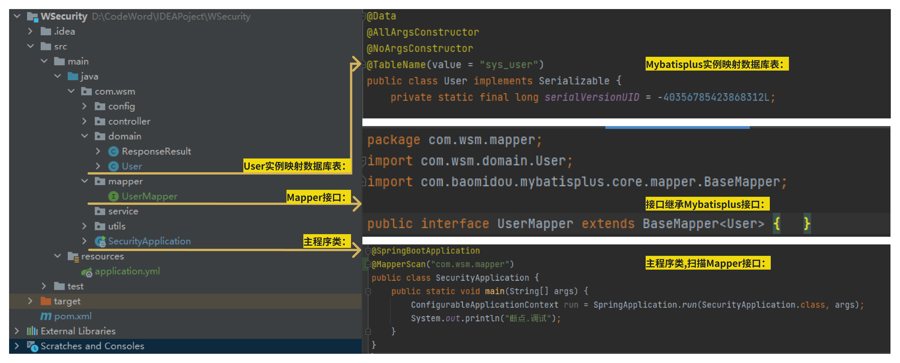

**MybatisPuls和mysql驱动的依赖：**

```xml
<!--mybatis-plus依赖-->
<dependency>
    <groupId>com.baomidou</groupId>
    <artifactId>mybatis-plus-boot-starter</artifactId>
    <version>3.4.3</version>
</dependency>
<!--mysql驱动依赖-->
<dependency>
    <groupId>mysql</groupId>
    <artifactId>mysql-connector-java</artifactId>
</dependency>
```

**`resources/application` 配置数据库信息：** 注意这里要设置自己的Mysql信息；

```yaml
spring:
  datasource:
    url: jdbc:mysql://localhost:3306/wsecurity?characterEncoding=utf-8&serverTimezone=UTC
    username: root
    password: admin
    driver-class-name: com.mysql.cj.jdbc.Driver
mybatis-plus:
  mapper-locations: classpath*:/mapper/**/*.xml
server:
  port: 8888
```

###  Junit 测试整合Mybatis：

**测试：项目整合Mybatis，配置Junit 单元测试依赖：** Spring Boot 2.2.x开始，默认集成`JUnit`，

```xml
<!--junit单元测试依赖-->
<dependency>
    <groupId>org.springframework.boot</groupId>
    <artifactId>spring-boot-starter-test</artifactId>
</dependency>
```

**/test 测试目录下：定义和 /main/java/xxx/xxx/主程序类一样的包路径：** `/test/java/com/wsm/xxx测试类.Java`

```java
//测试类注解
@SpringBootTest
public class MapperTest {
    
    @Autowired
    private UserMapper userMapper;
    
    @Test
    public void testUserMapper(){
        List<User> users = userMapper.selectList(null);
        System.out.println(users);
    }
}
```

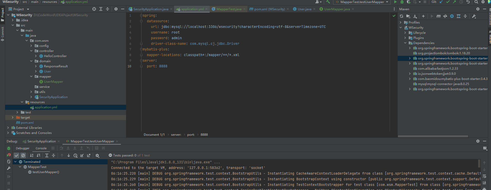

### 定义UserDetailsService 实现类

**核心代码：** 创建一个类实现`UserDetailsService`接口，重写其中的方法：**从数据库中查询用户信息；** 

**创建：** `service/impl/UserDetailsServiceImpl`，`UserDetailsService`接口实现类，

- **内：** 根据用户名查询用户信息、如果查询不到数据就通过抛出异常来给出提示，
- **上述：原理分析阶段：** 如果此过程保存，则直接被`ExceptionTranslationFilter` 捕获
- **最后：将查询到的用户信息，存入：** 自定义`UserDetails`对象，**LoginUser：实现了UserDetails 接口；**

```java
@Service
public class UserDetailsServiceImpl implements UserDetailsService {
    @Autowired
    private UserMapper userMapper;
    
    @Override
    public UserDetails loadUserByUsername(String username) throws UsernameNotFoundException {
        //根据用户名查询用户信息
        LambdaQueryWrapper<User> wrapper = new LambdaQueryWrapper<>();
        wrapper.eq(User::getUserName,username);
        User user = userMapper.selectOne(wrapper);
        //如果查询不到数据就通过抛出异常来给出提示
        if(Objects.isNull(user)){ throw new RuntimeException("用户名或密码错误"); }
        //TODO 根据用户查询权限信息 添加到LoginUser中,封装成UserDetails对象返回
        return new LoginUser(user);
    }
}
```

**LoginUser 自定义 UserDetails对象,内部封装了当前登录用户信息：** 

```java
@Data
@NoArgsConstructor
@AllArgsConstructor
//LoginUser 自定义 UserDetails对象,内部封装了当前登录用户信息: 获取用户名\密码\是否过期\...
public class LoginUser implements UserDetails {
    private User user;			//当然定义的User类,因为是重写所以暂时都是true,稍后做修改...
    @Override					//加载用户详细信息，包括用户的权限（或角色）
    public Collection<? extends GrantedAuthority> getAuthorities() { return null; }
    @Override					//获取用户密码
    public String getPassword() { return user.getPassword(); }
    @Override					//获取用户名
    public String getUsername() { return user.getUserName(); }
    @Override					//判断用户凭证是否已经过期
    public boolean isCredentialsNonExpired() { return true; }
    @Override					//判断帐号是否已经过期
    public boolean isAccountNonExpired() { return true; }
    @Override					//判断帐号是否已被锁定
    public boolean isAccountNonLocked() { return true; }
    @Override					//用户状态是否有效
    public boolean isEnabled() { return true; }
}
```


- **There is no PasswordEncoder mapped for the id "null"** 登录失败，输入用户密码和数据库不匹配；

  系统未能找到与密码字符串中指定ID匹配的`PasswordEncoder`，**因为：** `Spring Security 5.0`及以后的版本

  引入密码编码器标识符机制，每个密码前都会有一个标识符，如`{bcrypt}`、`{noop}`等，用来指示编码方式解码\验证；

- **所以：** 在数据库对于密码上添加：`{noop}` 就正常登录，**当然，实际开发中，不能这么操作，数据库密码还是明文存储；**

**扩展：** 有时候使用`Spring Security` 默认登录页，会因为：`部分网络原因` 一些CSS\JS、加载失败并不影响使用，请 科学上网；

## 密码加密存储

**Spring Security中，密码加密存储是确保用户数据安全的关键措施：** 实际项目中我们不会把密码明文存储在数据库中，

默认使用的`PasswordEncoder` 加密数据库密码格式为：`{id}password` ，它会根据id去判断密码的加密方式；

**实际开发中：几乎不会使用默认的加密：** 因为几乎是明文存储，不安全，**`Security` 也支持多种加密算法；**

- **BCryptPasswordEncoder：** 推荐使用，它在每次加密时都会生成不同的盐值，且计算成本可调；
- **NoOpPasswordEncoder：** 仅用于开发测试，不应用于生产环境，因为它不提供任何加密；
- **SCrypt、PBKDF2：** 安全的选择，特别是SCrypt设计来抵抗大规模定制硬件攻击；
- **SHA-256：** 哈希函数：虽然强大，但建议结合盐值使用，单独使用容易受到彩虹表攻击；

**另外，它有两个主要方法：** `encode`：加密原始密码，`matches`：比较加密后的密码和用户输入的密码是否匹配；

**因为：对密码进行加密，所以：在用户注册时候，数据库保存密码，可直接用：** `encode` 进行密文存储；

**🆗，让我们来体验修改一下，`Security` 的默认加密规则吧：** `config/SecurityConfig` 配置类；

```java
@Configuration
public class SecurityConfig extends WebSecurityConfigurerAdapter {
    @Bean
    public PasswordEncoder passwordEncoder(){ return new BCryptPasswordEncoder(); }
}
```

**Junit 测试加密、解密函数是否配置正常：** `/test/java/com/wsm/xxx测试类.Java`

```java
@Autowired
private PasswordEncoder passwordEncoder;    //加密/解密对象;

@Test
//测试加密解密操作;
public void TestBCryptPasswordEncoder(){
    //encode 加密操作\matches 判断原密码 密文是否匹配
    String encode1 = passwordEncoder.encode("123456");
    System.out.println(passwordEncoder.matches("123456",encode1));
    String encode2 = passwordEncoder.encode("123456");
    //且每次加密结果不一样,内部有加盐的操作
    System.out.println(encode1);
    System.out.println(encode2);
}
```

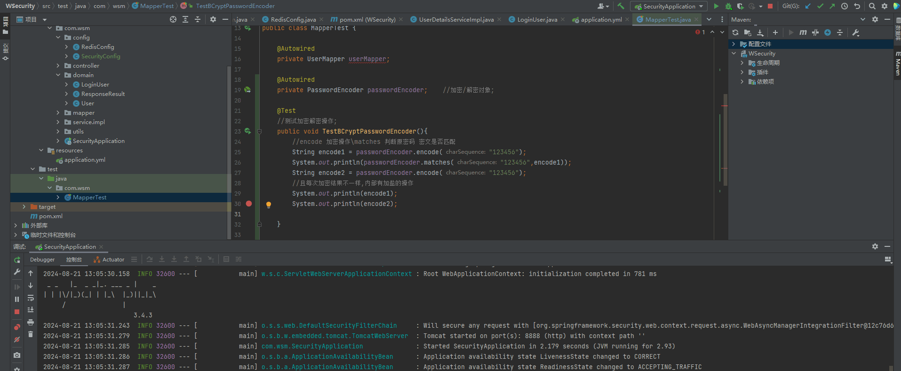

## 自定义登录接口：

**接下我们需要自定义登陆接口：** `controller/LoginController`

```java
@RestController
public class LoginController {
    @Autowired
    private LoginServcie loginServcie;
    
    @PostMapping("/user/login")
    public ResponseResult login(@RequestBody User user){ return loginServcie.login(user); }
}
```

 **SecurityConfig：** 首先：让`SpringSecurity` 对这个接口放行，让用户访问这个接口的时候不用登录也能访问；**重写；**

- **authenticationManagerBean()：** 在Spring容器中返回注入`AuthenticationManager`对象；

- **configure(HttpSecurity http)：** Spring Security核心配置，**很重要⭐，可以多了解使用；**

  **且，一点要放行，登录接口：** 不然获取鉴权的接口，需要先被鉴权；

  就像：手机忘记密码了，但备忘录记录密码：你得输入密码才能解锁手机，可我不解锁怎么知道密码，**死循环♻️**

```java
@Configuration
public class SecurityConfig extends WebSecurityConfigurerAdapter {
    @Bean
    //创建BCryptPasswordEncoder注入容器
    public PasswordEncoder passwordEncoder(){ return new BCryptPasswordEncoder(); }

    @Bean
    @Override
    //获取一个AuthenticationManager的bean实例,
    //AuthenticationManager是负责处理用户认证的核心组件,
    //此处: 是为了在Spring容器中返回注入 对象,以供登录请求获取 校验登录成功\失败
    public AuthenticationManager authenticationManagerBean() throws Exception {
        return super.authenticationManagerBean();
    }

    @Override
    //这个方法是Spring Security配置中的关键部分
    //用于定制Web安全策略,详细指定哪些URL路径需要认证、哪些可以公开访问、以及认证失败或成功后的处理逻辑等
    protected void configure(HttpSecurity http) throws Exception {
        http
        //关闭csrf
        .csrf().disable()
        //不通过Session获取SecurityContext
        .sessionManagement().sessionCreationPolicy(SessionCreationPolicy.STATELESS)
        .and().authorizeRequests()
        // 对于登录接口 允许匿名访问, 因为登录接口在鉴权之前, 不登录则不能鉴权 必须放行)
        .antMatchers("/user/login").anonymous()
        // 除上面外的所有请求全部需要鉴权认证
        .anyRequest().authenticated();
    }
}
```

**声明定义loginServcie 接口、并创建其实现类：`loginServcieImpl`：** 实现登录逻辑，

- **首先，注入：** `AuthenticationManager` \ `Redis` 工具类对象，
- **通过： authenticate进行用户认证、详情请看：👆原理分析图，** 经过一些列操作，经过自定义`UserDetailsService`
- **判断当前认证成功\失败 抛出异常)，成功：生成token、存入redis：** 返回前端，由前端存储Token，并后续接口携带请求；

```java
@Service
public class LoginServcieImpl implements LoginServcie {
    @Autowired  //AuthenticationManager是负责处理用户认证的核心组件;
    private AuthenticationManager authenticationManager;
    @Autowired  //Redis 操作工具类;
    private RedisCache redisCache;

    @Override
    //实现登录函数逻辑：
    public ResponseResult login(User user) {
        //AuthenticationManager authenticate 进行用户认证
        UsernamePasswordAuthenticationToken authenticationToken =
                new UsernamePasswordAuthenticationToken(user.getUserName(),user.getPassword());
        //认证成功，提供者返回一个填充了用户详细信息和授权信息的新Authentication对象
        //这个对象随后被Spring Security框架接受并存储在SecurityContextHolder中，表示用户当前的认证状态
        Authentication authenticate = authenticationManager.authenticate(authenticationToken);

        //判断当前认证成功、失败, 抛出接口异常;
        if(Objects.isNull(authenticate)){ throw new RuntimeException("用户名或密码错误"); }
        //使用userid生成token
        LoginUser loginUser = (LoginUser) authenticate.getPrincipal();
        String userId = loginUser.getUser().getId().toString();
        String jwt = JwtUtil.createJWT(userId);
        //authenticate存入redis
        redisCache.setCacheObject("login:"+userId,loginUser);
        //把token响应给前端
        HashMap<String,String> map = new HashMap<>();
        map.put("token",jwt);
        return new ResponseResult(200,"登陆成功",map);
    }
}
```

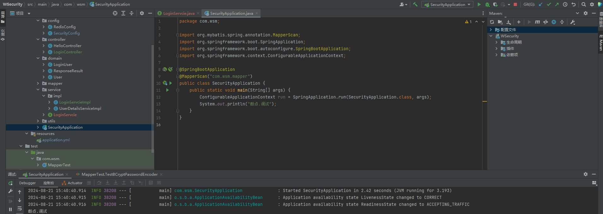

## 认证过滤器：

**终于、终于，完成了登录接口，** 不过还差亿点点的优化，**还，需要自定义一个过滤器，**

- **这个过滤器会去获取请求头中的`Token`，对`Token`进行解析取出其中的`userid`：** 
- 使用 `userid`去`redis`中获取对应的`LoginUser`对象； **然后封装：** 
- `Authentication`对象存入`SecurityContextHolder`

这样之后的每个请求都携带`Token`，经过过滤器，从而获取对应的用户信息；

### 定义过滤器：

**自定义：请求头Token解析过滤器：** `fitter/JwtAuthenticationTokenFilter` 

```java
@Component
public class JwtAuthenticationTokenFilter extends OncePerRequestFilter {
    @Autowired  //Redis 操作工具类;
    private RedisCache redisCache;
    
    @Override
    protected void doFilterInternal(HttpServletRequest request,
                                    HttpServletResponse response,
                                    FilterChain filterChain) throws ServletException, IOException {
        //获取token、判断是否存在token 不存在放行交给下一个过滤器处理
        String token = request.getHeader("token");
        if (!StringUtils.hasText(token)) {
            filterChain.doFilter(request, response);
            return;
        }
        //存在Token解析Token userid
        String userid;
        try {
            Claims claims = JwtUtil.parseJWT(token);
            userid = claims.getSubject();
        } catch (Exception e) {
            e.printStackTrace();
            throw new RuntimeException("token非法");
        }
        //从redis中获取用户信息
        String redisKey = "login:" + userid;
        LoginUser loginUser = redisCache.getCacheObject(redisKey);
        if(Objects.isNull(loginUser)){ throw new RuntimeException("用户未登录"); }
        //TODO 获取权限信息封装到Authentication中 存入SecurityContextHolder
        UsernamePasswordAuthenticationToken authenticationToken =
                new UsernamePasswordAuthenticationToken(loginUser,null,null);
        SecurityContextHolder.getContext().setAuthentication(authenticationToken);
        filterChain.doFilter(request, response);    //JWT过滤器结束放行、下一个过滤器
    }
}
```

**SecurityConfig：** 中配置、添加，自定义过滤器：把`token`校验过滤器添加到过滤器链中；

```java
//把token校验过滤器添加到过滤器链中
//http.addFilterBefore 将A过滤器添加至B过滤器之前,执行;
http.addFilterBefore(jwtAuthenticationTokenFilter, UsernamePasswordAuthenticationFilter.class);
```

### 断点 · 调试


## 退出登录：

**已经完成，登录，其实退出登录就非常，Easy了：** 删除`SecurityContextHolder`中的认证信息，删除`Redis`中的数据即可；

**定义退出登录接口：**  `controller/LoginController.logout` => `LoginService` => `LoginServiceImpl`

```java
@Override
public ResponseResult logout() {
    //获取SecurityContextHolder中的用户id
    UsernamePasswordAuthenticationToken authentication =
        (UsernamePasswordAuthenticationToken) SecurityContextHolder.getContext().getAuthentication();
    LoginUser loginUser = (LoginUser) authentication.getPrincipal();
    Long userid = loginUser.getUser().getId();
    //删除redis中的值
    redisCache.deleteObject("login:"+userid);
    return new ResponseResult(200,"注销成功");
}
```

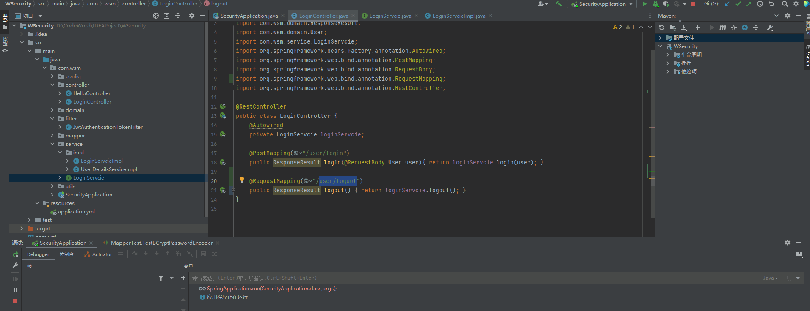

# 代码实践-授权：

## 权限系统的作用：

**权限管理，是所有后台系统的都会涉及的一个重要组成部分：** 

主要目的是对不同的人访问资源进行权限的控制，避免因权限控制缺失或操作不当引发的风险问题：**例如：图书管理系统：** 

- 普通学生，登录就能看到借书还书相关的功能，不可能看到并使用：添加书籍信息，删除书籍信息等功能，
- 但，图书馆管理员账号：就能看到并使用添加书籍信息，删除书籍信息等功能；

**总结：**  就是**不同的用户可以使用不同的功能**，这就是权限系统要去实现的效果，

- 我们不能 **只依赖前端** 去判断用户的权限，选择显示菜单按钮，

- 因为：如果，有人知道对应功能，接口地址就可以：**不通过前端，直接去发送请求来实现相关功能操作；**
- 所以：我们还需要在后台进行用户权限的判断，判断当前用户是否有相应的权限，必须具有所需权限才能进行相应的操作；

## 授权的基本流程：

**经过上述，原理分析：** 我们知道SpringSecurity，本质是一个：**过滤器链；** 

`自定义JWT认证过滤器==> UsernamePasswordAuthenticationFilter过滤器 ==>FilterSecurityInterceptor权限校验过滤器` 

- **非Token认证请求 登录举例)：** 前端发送登录请求，携带用户信息，因为是登录请求直接放行，经过过滤器层层传递，

  一直到`UserDetailsService` 接口，获取处理的用户信息，封装成一个`UserDetails` 对象；

  所有过滤器结束，登录是ServciceImpl实现，生成`JWT`存储`Redis`—>响应前端；

- **Token认证请求：** 首先，经过`自定义JWT认证过滤器` 验证\解析Token 合法性，

  **放行获取：`Redis` 的用户信息+权限；** 权限信息封装到`Authentication`中存入`SecurityContextHolder`

**🆗，** 接下来就开始进行：**用户+接口权限的校验**，`SpringSecurity` 默认的`FilterSecurityInterceptor`来进行权限校验；

`FilterSecurityInterceptor`中会从`SecurityContextHolder`获取其中的`Authentication`

**然后获取其中的权限信息，当前用户是否拥有访问当前资源所需的权限；** `我们需要做什么❓` 

- **首先：** 在登录、Token请求，**将用户的权限信息也存入Authentication**
- **其次：** 在`SpringSecurity` 配置：**接口资源匹配对应的权限校验；**

## 接口资源所需权限：

**`SpringSecurity` 为我们提供了基于注解的权限控制方案：** 我们可以使用注解，**指定访问资源所需的权限；**

```java
//SecurityConfig 开启配置
@Configuration
@EnableGlobalMethodSecurity(prePostEnabled = true)
public class SecurityConfig extends WebSecurityConfigurerAdapter { /* ..省略.. */ }
```

**在需要进行，权限校验接口添加：** `@PreAuthorize` 访问目标之前，对资源进行校验；

```java
@RestController
public class HelloController {
    //定义一个简单接口：
    @RequestMapping("/hello")
    @PreAuthorize("hasAuthority('test')")
    //测试案例： hasAuthority('xx'); Security中的一个表达式,检查当前经过认证的用户是否拥有指定的权限;
    public String hello(){ return "hello world"; }
}
```

## 获取封装权限信息：

**还记得：我们之前：`UserDetailsService实现类`、`自定义JWT过滤器` 的Todo：** 未开发完代码，我们需要在其中定义权限列表；

### UserDetailsService实现类

**说简单也简单：** 为了方便测试，此时暂时先定义一个：`假权限数组;` **UserDetailsServiceImpl.Java**

```java
//TODO 根据用户查询权限信息 添加到LoginUser中 自定义,测试)
//手动创建用户的权限数组,封装UserDetails对象;
List<String> list = new ArrayList<>(Arrays.asList("test"));
return new LoginUser(user,list);
```

其中返回了一个：**自定义UserDetails对象，** 需要在`UserDetail`接口实现中，小小的修改；

- 重写`UserDetails` 封装处理用户权限操作函数，**getAuthorities：** 加载用户详细信息\权限或角色) 

```java
@Data
@NoArgsConstructor
//@AllArgsConstructor   lombok生成所有的构造函数,因为手动实现了所以不需要生成的了
//LoginUser 自定义 UserDetails对象,内部封装了当前登录用户信息: 获取用户名\密码\是否过期\...
public class LoginUser implements UserDetails {
    private User user;			//当然定义的User类,因为是重写所以暂时都是true,稍后做修改...

    //存储权限信息、多参构造函数;
    private List<String> permissions;
    public LoginUser(User user,List<String> permissions) {
        this.user = user;
        this.permissions = permissions;
    }
    
    //定义存储权限信息的集合
    @JSONField(serialize = false)
    private List<GrantedAuthority> authorities; //因为其不支持序列化,serialize = false排除序列化

    //重写security 中UserDetails 封装处理用户权限操作函数;
    @Override					//加载用户详细信息，包括用户的权限（或角色）
    public Collection<? extends GrantedAuthority> getAuthorities() {
        //首先判断权限信息是否存在, 存在直接返回;
        if(authorities!=null){ return authorities; }
        //不存在, 根据 UserDetailsService 获取用户信息\权限,传递过来的数据进行解析生成;
        //JAVA8 Stream API 将用户权限集合string数据转换为: GrantedAuthority类型集合,
        //GrantedAuthority 对象：用于表示用户被授予的权限或角色,构造函数接受一个字符串参数
        authorities = permissions.stream().map(SimpleGrantedAuthority::new).collect(Collectors.toList());
        return authorities;
    }
    //...省略...其他函数重写...
}
```

### 自定JWT过滤器

**🆗，因为登录——>** `UserDetailsService` 实现类——>`UserDetails` 实现类，已经封装管理了`permissions` **权限集合；**

**前人栽树，后人乘凉，我们直接获取即可：** `JwtAuthenticationTokenFilter.Java`

```java
//TODO 获取权限信息封装到Authentication中 存入SecurityContextHolder
UsernamePasswordAuthenticationToken authenticationToken =
    new UsernamePasswordAuthenticationToken(loginUser,null,loginUser.getAuthorities());
```

### 断点 · 调试

- **LoginServcieImpl 断点：** 查询，登录请求封装的`UserDetails` 对象，记录的权限信息；
- **JwtAuthenticationTokenFilter 断点：** Token请求，过滤器获取`UserDetails` 对象中的权限信息；


**测试接口：权限：** `HelloController` —— `@PreAuthorize("hasAuthority('xxx')")` 检查当前接口是否拥有指定的权限；

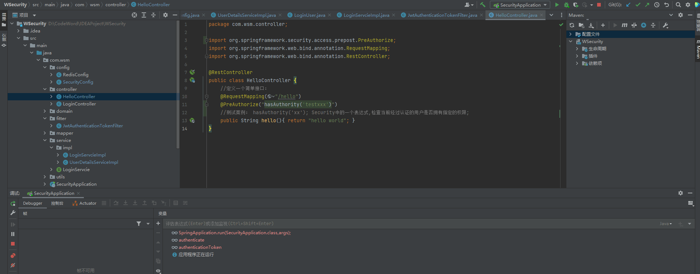

# 数据库查询权限信息：

## RBAC权限模型

`RBAC（Role-Based Access Control）`即：**基于角色的权限控制：** 基础概念👇

- **用户 User：** 系统的实际操作者，需要访问系统资源的实体；
- **角色 Role：**一组权限的集合，代表了权限级别，用户通过角色来获得相应的权限；

- **权限 Permission：** 允许执行的特定操作，如读、写、删除等，或访问特定资源的能力；

## 数据库表结构设计：

**首先需要创建5张表：** 用户表、角色表、权限表、用户角色关联表`多对多`、角色权限关联表`多对多`

**其中：用户角色关联表里存的是用户表id和角色表id，同样的，角色权限表存的是用户表id和权限表id**

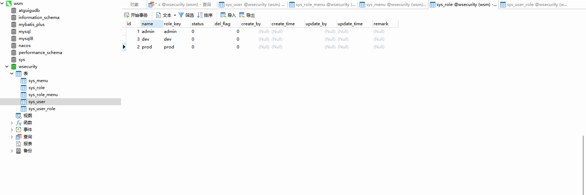

## 代码实现-数据库权限获取：

我们需要根据：用户`id`，去查询到其所对应的权限信息即可：所以：我们需要定义个`sys_menu` 对应的；

**定义数据库表，对应的实体、mapper、service…**，提供方法：根据 `userid` 查询权限信息；

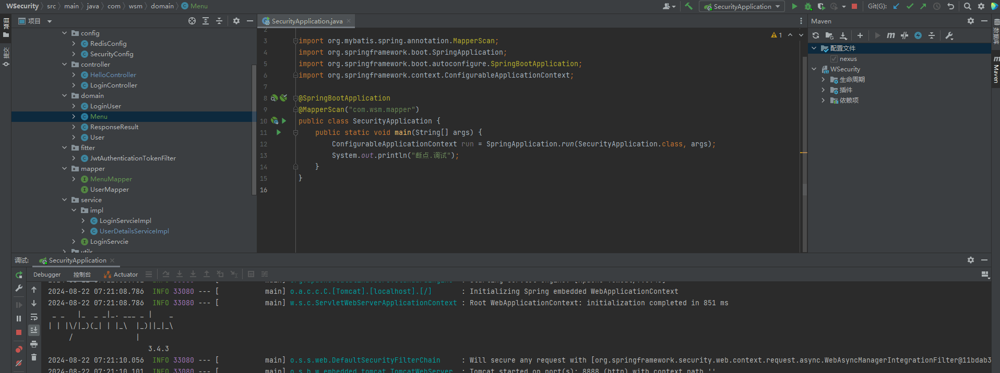

**最后：** 修改，在`UserDetailsServiceImpl` 中去调用`mapper`方法查询，**权限信息封装到`LoginUser`对象中即可；**

```java
//TODO 根据用户查询权限信息 添加到LoginUser中 自定义,测试)
//手动创建用户的权限数组,封装UserDetails对象;
//List<String> list = new ArrayList<>(Arrays.asList("test","admin"));
//自动：从数据库中获取当前用户权限列表
List<String> list =  menuMapper.selectPermsByUserId(user.getId());
return new LoginUser(user,list);
```

**注意：** 别忘了在接口上，定义对应的权限字符：`@PreAuthorize("hasAuthority('system:dept:list')")`

## 自定义失败处理：

**在Spring Security框架中，自定义失败处理机制，允许开发者定制用户认证或授权失败时的行为：**

如果我们在 **认证、授权** 的过程中出现了异常会被`ExceptionTranslationFilter`捕获到，**判断是认证失败还是授权失败：**

- **认证过程中出现的异常会被封装成AuthenticationException：** 调用**AuthenticationEntryPoint**对象方法进行异常处理；

- **授权过程中出现的异常会被封装成AccessDeniedException：** 调用**AccessDeniedHandler**对象方法进行异常处理；

所以我们需要自定义异常处理，只需要自定义：`AuthenticationEntryPoint`、`AccessDeniedHandler`

**然后配置给SpringSecurity即可；**

### AuthenticationEntryPoint

```java
@Component
public class AuthenticationEntryPointImpl implements AuthenticationEntryPoint {
    @Override
    public void commence(HttpServletRequest request, HttpServletResponse response, AuthenticationException authException) throws IOException, ServletException {
        ResponseResult result = new ResponseResult(HttpStatus.UNAUTHORIZED.value(), "认证失败请重新登录");
        String json = JSON.toJSONString(result);	//解析JSON字符
        WebUtils.renderString(response,json);		//WebUtils web响应工具包
    }
}
```

### AccessDeniedHandler

```java
@Component
public class AccessDeniedHandlerImpl implements AccessDeniedHandler {
    @Override
    public void handle(HttpServletRequest request, HttpServletResponse response, AccessDeniedException accessDeniedException) throws IOException, ServletException {
        ResponseResult result = new ResponseResult(HttpStatus.FORBIDDEN.value(), "权限不足");
        String json = JSON.toJSONString(result);	//解析JSON字符
        WebUtils.renderString(response,json);		//WebUtils web响应工具包
    }
}
```

### Security 配置类：

```java
//配置异常处理器：
http.exceptionHandling()
    .accessDeniedHandler(accessDeniedHandler)
    .authenticationEntryPoint(authenticationEntryPoint);
```

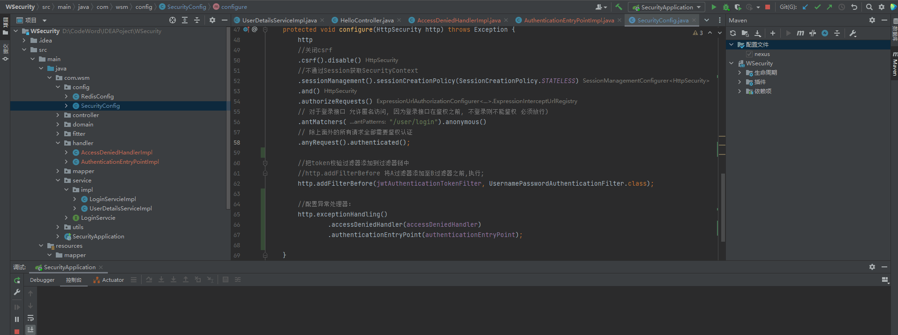

## Security 跨域：

**浏览器，出于安全的考虑，使用 XMLHttpRequest对象发起 HTTP请求时必须遵守同源策略：** `只有浏览器才会存在跨域问题.`

**同源策略：要求源相同才能正常进行通信，即协议、域名、端口号都完全一致；**

- 前后端分离项目，前端项目和后端项目一般都不是同源的，
- 所以肯定会存在跨域请求的问题；

**SpringBoot 跨域配置：** `config/CorsConfig` 没什么好介绍的，直接Copy

```java
@Configuration
public class CorsConfig implements WebMvcConfigurer {

    @Override
    public void addCorsMappings(CorsRegistry registry) {
      // 设置允许跨域的路径
        registry.addMapping("/**")
                // 设置允许跨域请求的域名
                .allowedOriginPatterns("*")
                // 是否允许cookie
                .allowCredentials(true)
                // 设置允许的请求方式
                .allowedMethods("GET", "POST", "DELETE", "PUT")
                // 设置允许的header属性
                .allowedHeaders("*")
                // 跨域允许时间
                .maxAge(3600);
    }
}
```

**SpringSecurity 跨域：** 依然是操作：`config/SecurityConfig类中的 configure函数` 添加：`http.cors(); //开启跨域` 

**感谢大佬，为了方便测试，还准备了一个前端的包：** `后面统一打包分享、或BiliBili up主 三更草堂`

# Security 扩展配置：

## 其它权限校验方法：

我们前面都是使用`@PreAuthorize`注解，在其中使用的是`hasAuthority`方法进行校验；

**SpringSecurity还为我们提供了其它方法例如：** `hasAnyAuthority`，`hasRole`，`hasAnyRole`等；

这里我们先不急着去介绍这些方法，**我们先去理解hasAuthority的原理：**，然后再去学习其他方法你就更容易理解


- `hasAuthority` 方法实际是执行 `SecurityExpressionRoot`的`hasAuthority` 
- `this.getAuthoritySet();` 函数返回，之前登录获取的用户权限信息，便利其集合，判断是否存在参数，返回`true`

**hasAnyAuthority：** 方法可以传入多个权限，只有用户有其中任意一个权限都可以访问对应资源

**hasAnyRole：** 它内部也会把我们传入的参数拼接上 **ROLE_** 后再去比较，`any` 支持传多个权限，匹配任意一个权限即，成立；

**hasRole：** 它内部会把我们传入的参数拼接上 **ROLE_** 后再去比较，**和 hasAnyRole 类型但仅支持传一个参数；**

```java
@PreAuthorize(hasAnyAuthority("x","xx","xxx"));	//方法可以传入多个权限,匹配任意一个权限即,成立;
@PreAuthorize(hasAnyRole("x","xx","xxx"));		//ROLE_x、ROLE_xx、ROLE_xxx 匹配任意即,成立;
@PreAuthorize(hasRole("xxxx"));					//相当于和用户权限: ROLE_xxxx 进行匹配;
```

### 自定义：权限校验方法

**我们也可以定义自己的权限校验方法，在@PreAuthorize注解中使用我们的方法：** 

```java
@Component("diy")
//将对象注入至Spring容器管理
public class SGExpressionRoot {
    public boolean hasAuthority(String authority){
        //获取当前用户的权限
        Authentication authentication = SecurityContextHolder.getContext().getAuthentication();
        LoginUser loginUser = (LoginUser) authentication.getPrincipal();
        List<String> permissions = loginUser.getPermissions();
        //判断用户权限集合中是否存在authority
        return permissions.contains(authority);
    }
}
```

**这里仅是一个Demo 实际情况，可根据项目定制：** `HelloController ` 中使用；

```java
@RestController
public class HelloController {
    //定义一个简单接口：
    @RequestMapping("/hello")
//    @PreAuthorize("hasAuthority('test')")
//    @PreAuthorize("hasAuthority('system:dept:index')")
    @PreAuthorize("@diy.hasAuthority('system:dept:index')")
    //测试案例： hasAuthority('xx'); Security中的一个表达式,检查当前经过认证的用户是否拥有指定的权限;
    public String hello(){ return "hello world"; }
}
```


## CSRF

**CSRF`Cross-Site Request Forgery`，中文名为跨站请求伪造，是一种网络攻击手段：**

它利用用户已经登录的Web应用程序的漏洞，诱导用户在不知情的情况下执行非本意的操作，**攻击原理：**

- **用户正常登录：** 用户在受信任的网站A上登录，其浏览器保存了网站A的认证凭证
- **中间人攻击：** 攻击者通过社交工程、其他方式诱使用户在A网站——访问——恶意网站B
- **伪造请求：** 由此，B获取A请求携带的`cookie`，**B保存并携带`A-cookis` 包含恶意代码，向网站A发送请求**

**网站A接收到请求时，因为请求带有合法的认证信息，会误认为是用户主动发起的，从而执行该请求**

- 攻击者可能让受害者执行如转账、更改密码、发布内容等操作，而用户对此一无所知；

**早期：常见的一种攻击手段，不过现在有丰富的防御措施：**

- **使用CSRF Token：** 在表单中加入一个隐藏字段，其值为一个随机生成的、一次性的Token

  服务器端会验证这个Token是否与用户会话中的Token匹配，不匹配则拒绝请求；

- **POST请求验证：** 鼓励使用POST而非GET请求处理敏感操作，因为GET请求更容易被链接伪造；

- **双cookie策略：** 一些高级防御策略会使用两个Cookie，一个标记为HttpOnly，另一个用于验证CSRF令牌；

# 代码管理：

**本代码已经使用Git进行管理：** 公众号回复：`SpringBoot`

项目版本，较低，实际开发可能有所差异，本篇：主要以学习SpringSecurity 流程模式为主；

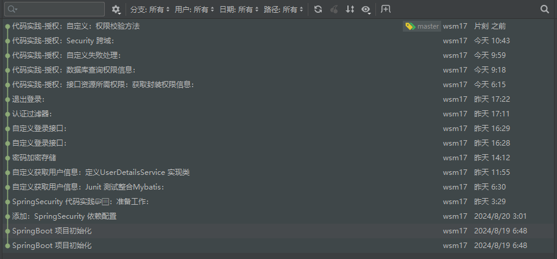


# 草稿区

[Spring Security 详解_springsecurity详解-CSDN博客](https://blog.csdn.net/lps12345666/article/details/129801402?ops_request_misc=&request_id=&biz_id=102&utm_term=详细介绍一下 SpringSecurity&utm_medium=distribute.pc_search_result.none-task-blog-2~blog~sobaiduweb~default-0-129801402.nonecase&spm=1018.2226.3001.4450)、

[为什么springboot项目更多的选择了SpringSecurity](https://www.zhihu.com/question/535423156/answer/2509290886)、

[清晰搞懂Spring Security的登录认证_springbootsecurity登录认证-CSDN博客](https://blog.csdn.net/Aqting/article/details/125857193?ops_request_misc=%7B%22request%5Fid%22%3A%22172411137716800226568212%22%2C%22scm%22%3A%2220140713.130102334..%22%7D&request_id=172411137716800226568212&biz_id=0&utm_medium=distribute.pc_search_result.none-task-blog-2~blog~top_positive~default-1-125857193-null-null.nonecase&utm_term=三更springsercurity笔记&spm=1018.2226.3001.4450)、

[继认证后弄清Spring Security实现授权_springsecurity5实现授权-CSDN博客](https://blog.csdn.net/Aqting/article/details/125903697)、


**后续，获取用户信息就可以通过，LoginUser：** 直接获取；

这个文章试一下全发，CSDN


